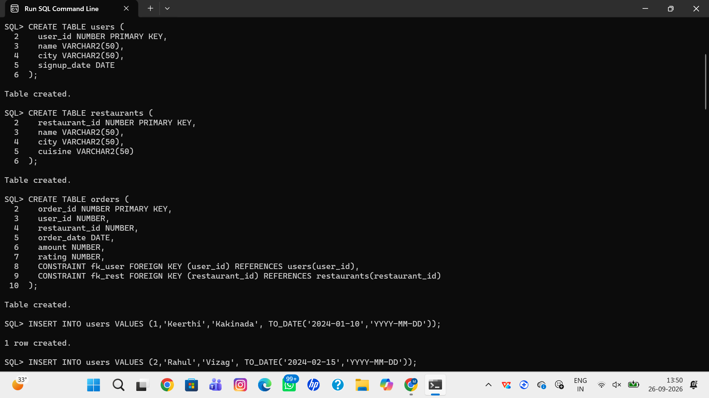
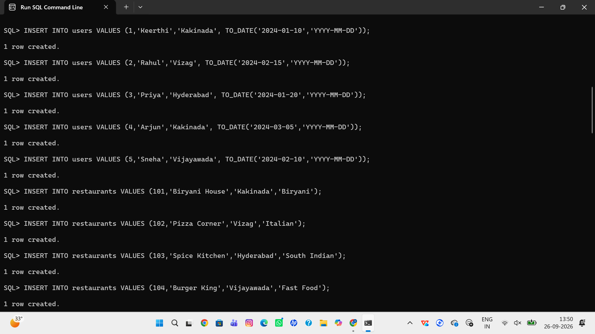
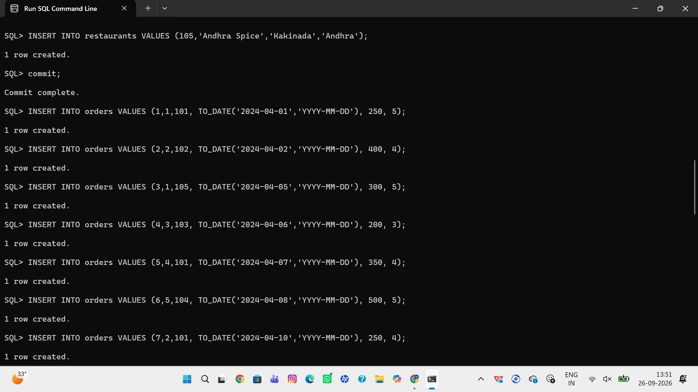
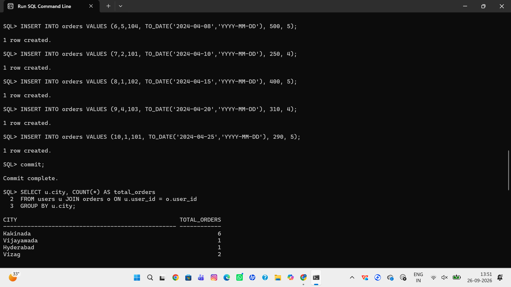
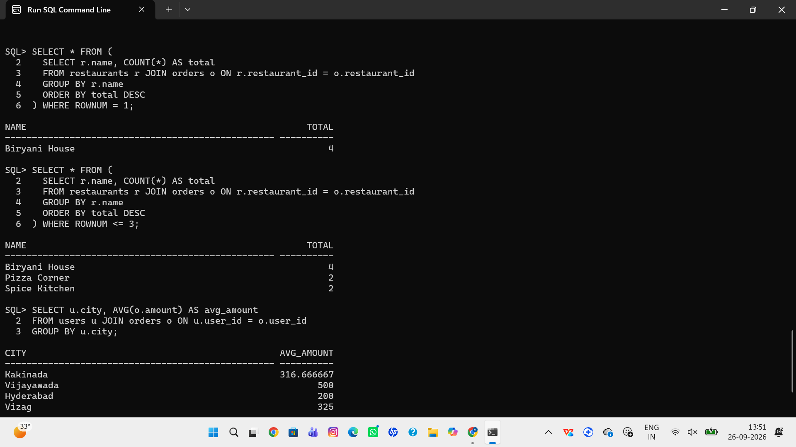

# 🍔 Zomato/Swiggy Analysis - Oracle SQL Project

> **Food delivery data analysis using Oracle SQL 11g - Intermediate Level**

### 👩‍💻 Created by: Padala Mani Keerthi | Aspiring Data Analyst | Kakinada

---

### 📊 About Project
This project analyzes real-time Swiggy/Zomato style data to find business insights. After completing my SQL Intermediate certification, I built this project in Oracle 11g.

### 🗃️ Database Design
- **users** - Customer details (user_id, name, city, signup_date)
- **restaurants** - Restaurant info (restaurant_id, name, city, cuisine)
- **orders** - Order transactions with Foreign Keys

### 🔍 Key Analysis Queries Solved
1. City-wise total orders
2. Top performing restaurant (using ROWNUM for 11g compatibility)
3. Average order value per city
4. Loyal customers with >2 orders
5. Highest rated restaurant

### 🛠️ Tech Stack
Oracle SQL 11g, SQL*Plus, JOINs, GROUP BY, ROWNUM, Aggregations

### 📂 Files in this Repo
- `zomato_project_oracle.sql` - Full SQL script (Table + Data + Queries)
- Screenshots - Execution proof from Oracle

---

### 📸 Project Execution Proof

**Step 1: Tables Created Successfully in Oracle**

**Step 2: Data Insertion**

**Step 3: Analysis Queries Output**

---

### 🚀 How to Run
1. Open Oracle SQL Command Line
2. Run `@zomato_project_oracle.sql`
3. Check results with SELECT queries

### 📈 Key Insights Found
- Kakinada & Vizag have highest orders
- Biryani House is top restaurant
- Loyal customers identified for marketing

### 👩‍💻 Created by
Padala Mani Keerthi | Aspiring Data Analyst | Kakinada

---
⭐ If you like this project, please give a Star!
